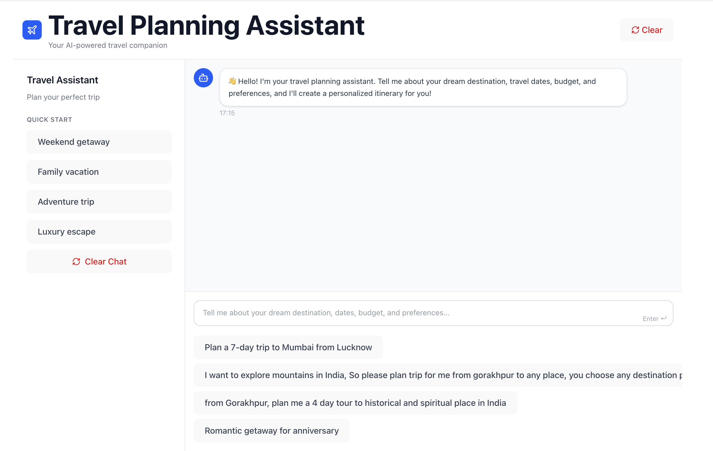

# AI-Powered Travel Planner 🗺️✈️



An intelligent travel planning assistant that helps you create personalized travel itineraries using AI. Simply describe your travel preferences, and the assistant will generate a detailed travel plan for you.

## 🌟 Features

- **AI-Powered Itinerary Generation**: Get personalized travel plans based on your preferences
- **Real-time Streaming**: Watch your travel plan being generated in real-time
- **Interactive Chat Interface**: Natural conversation with the travel assistant
- **Quick Start Templates**: Get started quickly with pre-defined travel templates
- **Responsive Design**: Works on both desktop and mobile devices
- **Modern UI/UX**: Clean and intuitive user interface built with React and Tailwind CSS

## 🛠️ Tech Stack

### Frontend

- React 19
- TypeScript
- Vite
- Tailwind CSS
- Lucide Icons

### Backend

- FastAPI (Python)
- Mistral AI (for travel planning)
- Uvicorn (ASGI server)
- **uv** (Python package manager)

## 🚀 Getting Started

### Prerequisites

- Node.js (v18+)
- Python (3.9+)
- [uv](https://github.com/astral-sh/uv) (latest Python package manager)

---

### ⚙️ Backend Setup

1. Clone the repository:

   ```bash
   git clone https://github.com/asyncarush/travel-planner-assistant
   cd travel-planner-assistant
   ```

2. Create and activate a virtual environment with **uv**:

   ```bash
   uv venv
   source .venv/bin/activate   # On Linux/Mac
   .venv\Scripts\activate      # On Windows
   ```

3. Install dependencies:

   ```bash
   uv sync
   ```

4. Run the backend server:

   ```bash
   uv run python3 app/main.py
   ```

   The FastAPI server will start at **http://localhost:8000**

---

### 🎨 Frontend Setup

1. Navigate to the frontend directory:

   ```bash
   cd frontend
   ```

2. Install dependencies:

   ```bash
   npm install
   ```

3. Start the development server:

   ```bash
   npm run dev
   ```

   The frontend will be available at **http://localhost:5173**

---

### ▶️ Usage

1. Start the **backend** (FastAPI with Uvicorn).
2. Start the **frontend** (React + Vite).
3. Open the app in your browser:
   ```
   http://localhost:5173
   ```
4. Enter your travel preferences in the chat interface and watch your personalized itinerary being generated in real-time!

---

### 📂 Project Structure

```
travel-planner/
│── app/             # FastAPI backend
│   ├── agent        # Entry point
│       ├── agent.py
│       ├── model.py
│       ├── prompts.py
│   ├── main.py      # main running file
│── frontend/       # React + Vite frontend
│   ├── src/
│   ├── public/
|── pyproject.toml
|── uv.lock
│── README.md
```

---

### 📜 License

This project is licensed under the **MIT License** – feel free to use and modify it.
